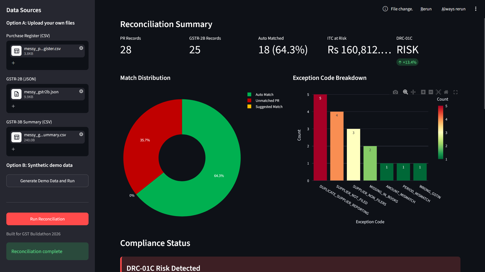
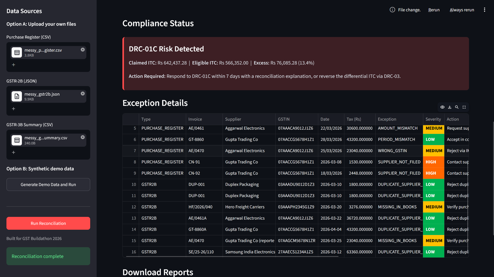
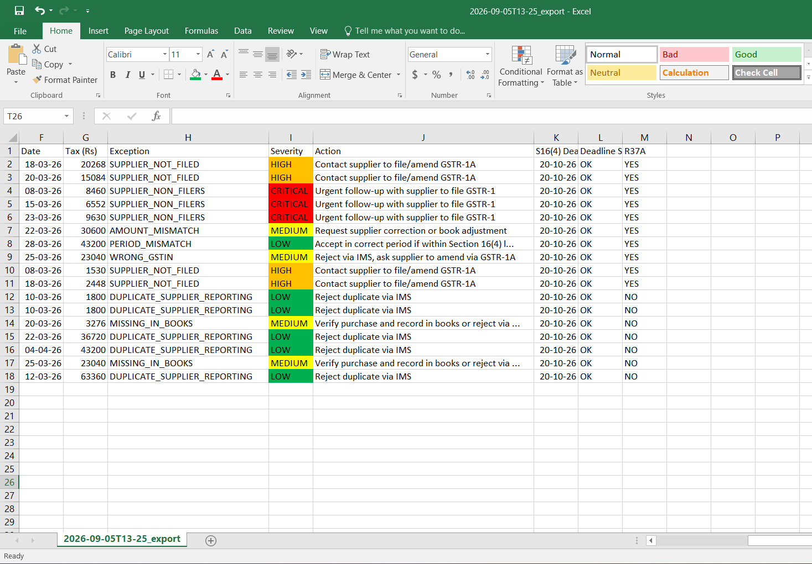

<div align="center">

# ReconX: Automated GST ITC Reconciliation & Compliance Agent

**Live Demo:** [gst-itc-reconciliation-agent.streamlit.app](https://gst-itc-reconciliation-agent.streamlit.app/)

[](https://github.com/puneetkaur23/gst-itc-reconciliation-agent/actions)
[](https://www.python.org/)
[](https://streamlit.io/)

</div>

---

## The Problem

Under India's GST system, businesses can only claim Input Tax Credit (ITC) if their suppliers actually reported those sales in GSTR-1. Every month, finance teams manually reconcile their Purchase Register against government-reported GSTR-2B data — line by line, in Excel. It's slow, error-prone, and expensive to get wrong:

- **Claim too much ITC** → DRC-01C notice from GSTN, penalties, and blocked refunds
- **Miss eligible credit** → Real money lost because a supplier forgot to file
- **No audit trail** → CAs can't prove how reconciliation decisions were made

**ReconX automates this entire pipeline** — from messy invoice normalization to compliance risk alerts — in under 15 seconds.

---

## Try It Live

No installation required. Upload your Purchase Register (CSV), GSTR-2B (JSON), and GSTR-3B Summary (CSV), or generate synthetic demo data with one click.

**[Launch ReconX Dashboard](https://gst-itc-reconciliation-agent.streamlit.app/)**

> *Hosted on Streamlit Cloud free tier. First load may take ~30 seconds to wake up.*

---

## What It Does

### 1. Ingest & Normalize
Cleans real-world invoice mess automatically:
- `INV/2026/0042` → `42`
- `15/03/2026`, `15-03-26`, `09.03.2026` → standardized ISO date
- `"1,00,000.00"` → `100000.0`

### 2. Fuzzy Matching (GSTIN-Blocked)
4-dimension weighted scoring with hard GSTIN blocking — invoices from different suppliers can **never** be wrongly paired.

| Dimension | Weight | Logic |
|-----------|--------|-------|
| Invoice Number | 40% | `rapidfuzz` ratio on normalized tokens |
| Date | 30% | Exact = 1.0, linear decay within ±3 days |
| Taxable Value | 20% | Within ±1% or ₹5 = 1.0 |
| Total Tax | 10% | Same tolerance as taxable value |

**Thresholds:** Auto-match ≥ 0.90 | Suggested ≥ 0.70 | No match < 0.70

### 3. 7-Exception Classification
Every unmatched invoice gets a specific reason code, severity, and action item:

| Exception Code | What It Means | Severity | Action |
|----------------|---------------|----------|--------|
| `WRONG_GSTIN` | Invoice found under a different supplier's GSTIN | MEDIUM | Reject via IMS, ask supplier to amend GSTR-1A |
| `PERIOD_MISMATCH` | Invoice exists but reported in a different tax period | LOW | Accept in correct period if within Section 16(4) limit |
| `AMOUNT_MISMATCH` | Invoice number & date match, but amounts differ | MEDIUM | Request supplier correction or book adjustment |
| `SUPPLIER_NOT_FILED` | Supplier filed other invoices, but forgot this one | HIGH | Contact supplier to file / amend GSTR-1A |
| `SUPPLIER_NON_FILERS` | Supplier has **zero** invoices in GSTR-2B this period | CRITICAL | Urgent follow-up — potential fake supplier |
| `DUPLICATE_SUPPLIER_REPORTING` | Same invoice reported twice by supplier | LOW | Reject duplicate via IMS |
| `MISSING_IN_BOOKS` | Government shows an invoice not in your books | MEDIUM | Verify purchase and record, or reject via IMS |

### 4. Compliance Tracking
- **Section 16(4):** Claim deadline monitoring (FY 2025-26 → October 20, 2026)
- **Rule 37A:** Auto-trigger reversal alerts when suppliers haven't filed
- **DRC-01C Risk:** Cross-checks claimed ITC vs. computed eligible ITC; fires when excess > 5%

### 5. Audit-Ready Outputs
- **Exception Report (Excel)** — color-coded severity (red/orange/yellow/green)
- **Full JSON Result** — machine-readable for downstream ERP integration
- **Audit Trail** — every match decision with scores and normalization steps
- **Markdown Summary** — human-readable report for CAs

---

## Architecture

```
┌─────────────────┐     ┌─────────────────┐     ┌─────────────────┐
│ Purchase Reg.   │     │ GSTR-2B (JSON)  │     │ GSTR-3B Summary │
│    (CSV)        │     │                 │     │    (CSV)        │
└────────┬────────┘     └────────┬────────┘     └────────┬────────┘
         │                       │                       │
         └───────────────────────┼───────────────────────┘
                                 ▼
                    ┌─────────────────────┐
                    │   ingest.py         │
                    │   + normalize.py    │
                    │   (clean & flatten) │
                    └──────────┬──────────┘
                               ▼
                    ┌─────────────────────┐
                    │   matcher.py        │
                    │   Fuzzy scoring     │
                    │   GSTIN blocking    │
                    └──────────┬──────────┘
                               ▼
                    ┌─────────────────────┐
                    │  exceptions.py      │
                    │  7-code classifier  │
                    └──────────┬──────────┘
                               ▼
                    ┌─────────────────────┐
                    │  compliance.py      │
                    │  S16(4) | R37A |    │
                    │  DRC-01C engine     │
                    └──────────┬──────────┘
                               ▼
                    ┌─────────────────────┐
                    │   report.py         │
                    │   Excel / JSON / MD │
                    └──────────┬──────────┘
                               ▼
                    ┌─────────────────────┐
                    │   Streamlit UI      │
                    │   + Download        │
                    └─────────────────────┘
```

---

## Screenshots

| Dashboard Overview | Compliance Alert | Exception Table |
|---|---|---|
|  |  |  |


---

## Quick Start

### Option A: Use the Live Dashboard (Recommended)
1. Go to **[reconx-gst.streamlit.app](https://gst-itc-reconciliation-agent.streamlit.app/)**
2. Upload your 3 files **or** click **"Generate Demo Data and Run"**
3. Review charts, exception table, and DRC-01C risk alert
4. Download Excel / JSON / Markdown reports

### Option B: Run Locally

```bash
# 1. Clone the repo
git clone https://github.com/puneetkaur23/gst-itc-reconciliation-agent.git
cd gst-itc-reconciliation-agent

# 2. Install dependencies
py -m pip install -r requirements.txt

# 3. Generate synthetic test data
py data/generate_synthetic_data.py

# 4. Run CLI version
py run.py

# 5. Or launch the Streamlit dashboard
py -m streamlit run app.py
```

### Run Tests
```bash
py -m pytest tests/ -v
# Expected: 46 passed
```

---

## Tech Stack

| Layer | Tools |
|-------|-------|
| **Backend** | Python 3.12, rapidfuzz, pandas, openpyxl |
| **Frontend** | Streamlit, Plotly |
| **Testing** | pytest (46 tests) |
| **Deployment** | Streamlit Cloud |

---

## Project Structure

```
gst-itc-reconciliation-agent/
├── app.py                          # Streamlit dashboard (entry point)
├── run.py                          # CLI entry point
├── requirements.txt
├── .streamlit/
│   └── config.toml                 # Dark theme config
├── data/
│   ├── generate_synthetic_data.py  # Demo data generator
│   ├── purchase_register.csv
│   ├── gstr2b.json
│   ├── gstr3b_summary.csv
│   └── ground_truth.json           # Test labels
├── src/
│   ├── normalize.py                # Invoice/date/amount cleaning
│   ├── ingest.py                   # Data loader
│   ├── matcher.py                  # Fuzzy matching engine
│   ├── exceptions.py               # 7-code classifier
│   ├── compliance.py               # Deadline & risk tracking
│   ├── report.py                   # Excel/JSON/MD generators
│   └── agent.py                    # Orchestrator
├── tests/
│   └── test_reconciliation.py      # 46 unit + integration tests
└── output/                         # Generated reports (gitignored)
```

---

## Buildathon Context

Built for **GST Buildathon 2026** (Razorpay). The project demonstrates:
- **Real-world problem:** Manual GST reconciliation costs Indian businesses ₹8,000+ crores in lost ITC annually
- **Technical depth:** Fuzzy matching with domain-specific constraints (GSTIN blocking, consumed-flag deduplication)
- **Compliance rigor:** Honest DRC-01C cross-check using computed eligible ITC, not self-reported numbers
- **Production thinking:** Audit trails, severity color-coding, and both CLI + web interfaces


---

<div align="center">

**[Try Live Demo](https://gst-itc-reconciliation-agent.streamlit.app/)** &nbsp;&middot;&nbsp; **[Report Issue](https://github.com/puneetkaur23/gst-itc-reconciliation-agent/issues)**

</div>
